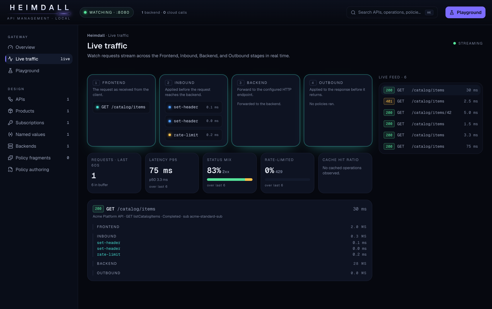

#  Heimdall

**A local, offline emulator of the Azure API Management (APIM) data plane - with a live policy-trace console.**

[](https://github.com/twentytwokhz/heimdall/actions/workflows/ci.yml)  [](https://hub.docker.com/r/florinbobis/heimdall)   


> Live policy tracing in the embedded console. [Watch the full walkthrough (MP4)](assets/heimdall-walkthrough.mp4).

---

[Azure API Management](https://learn.microsoft.com/azure/api-management/) has **no official local emulator**. Every policy change means a live cloud
instance (tens of minutes to provision, on a paid tier), a deploy, and a guess. The self-hosted
gateway isn't a local option either - it's data-plane only and needs the cloud instance to run.

**Heimdall runs APIM locally.** `docker run`, point it at your policy XML and OpenAPI spec, and the
edit-to-test loop drops from minutes to **under 2 seconds** - fully offline, no Azure account.

It is **not a mock.** Real C# policy expressions evaluated with **Roslyn**. Real `validate-jwt`,
`rate-limit`, `set-backend-service`, `choose/when`, caching, named values, subscription keys. Real
backends. For the supported policy set, the gateway behaves like production APIM - same `401`/`429`
shapes, same header/body transforms.

And a **console that traces every request** through inbound → backend →
outbound, live - what Azure's own portal makes painful.



---

## Features

- **A real policy engine, not a mock.** C# `@()` expressions compiled and cached with Roslyn; the
  four-stage pipeline (inbound → backend → outbound → on-error) runs ~25 tier-1 policies with `<base/>`
  flattening across global, product, API, and operation scope. Same `401`/`429` shapes and header/body
  transforms as production APIM.
- **A live trace console.** Watch every request stream across the Frontend → Inbound → Backend →
  Outbound canvas in real time, with per-policy timings, branch decisions, before/after transforms,
  evaluated expression results, and a live metrics strip.
- **A config explorer.** Browse APIs, operations, products, subscriptions, named values, and backends,
  with the flattened effective policy per operation. Secrets are masked.
- **A request playground.** Import a Postman or `.http` collection, edit method/URL/headers/body, replay
  through the live gateway, and jump straight to the correlated trace.
- **In-browser policy authoring.** Edit policy XML and hot-reload it into the running gateway in memory,
  no restart.
- **Loaders for artifacts you already have.** Raw policy XML + OpenAPI, or an
  [APIOps](https://github.com/Azure/apiops) v6 extractor folder (the same output your APIM CI/CD
  produces). New config formats plug in as adapters.
- **Fully offline and container-ready.** No Azure account, no cloud calls, edit-to-test under 2 seconds.
  Ships as a single Docker image, with a headless mode for CI.

---

## Quickstart

```bash
# Run the gateway against a config directory (policy XML + OpenAPI + config.json)
docker run -p 8080:8080 -v "$(pwd)/samples:/config" heimdall --config /config

# Send a request through it - watch it forward to your backend, with policies applied
curl -H "Ocp-Apim-Subscription-Key: <key>" http://localhost:8080/catalog/items

# Open the console (live trace, config explorer, request playground) at:
#   http://localhost:8080
```

Or bring up the gateway + a sample backend together:

```bash
docker compose up
```

### Load from an APIOps extractor folder

Heimdall reads an [APIOps](https://github.com/Azure/apiops) **v6** extractor folder directly, so you can
run the same artifacts your APIM CI/CD already produces:

```bash
docker compose -f docker-compose.apiops.yml up
```

Set `Heimdall:ConfigLoader=ApiOps` and point `Heimdall:ConfigPath` at the extractor output. The extractor
never exports secrets, so supply the two things it omits, subscription keys and secret named-value
values, in a `heimdall.overrides.json` at the folder root:

```json
{
  "subscriptions": [
    { "id": "acme-standard-sub", "primaryKey": "...", "secondaryKey": "...",
      "scope": "Product", "productId": "acme-standard", "state": "Active" }
  ],
  "namedValues": { "secret-named-value": "local-dev-value" }
}
```

A worked example lives in [`samples/apiops-layout/`](samples/apiops-layout). With the admin API enabled
(`Heimdall:EnableAdminApi=true`), `GET /admin/status` reports the loaded counts and `POST /admin/reload`
re-reads the folder.

> A real `heimdall.overrides.json` holds actual subscription keys and secret values, so keep it out of
> version control (`.gitignore` it). The admin API is unauthenticated; leave it off
> (`Heimdall:EnableAdminApi=false`, the default) for anything network-accessible - it is a local-dev aid.

## The console

A web console served by the gateway itself (same container) at **`/_apim/`** (e.g.
`http://localhost:8080/_apim/`). It mirrors APIM's mental model - the
**Frontend → Inbound → Backend → Outbound** policy canvas - but adds what Azure can't do locally:

- **Live request tracing** - click a request, watch which policies fired, branch decisions, header
  and body transforms (before → after), evaluated `@()` expression results, rate-limit/cache hits,
  the resolved backend, and the final status.
- **Config explorer** - browse APIs, operations, products, subscriptions, named values, and the
  flattened effective policy per operation.
- **Request playground** - compose or **import a Postman / `.http` collection**, fire it through the
  gateway, and watch the trace light up.
- **Policy authoring** - edit policy XML in-browser and hot-reload.

Set `Heimdall:EnableConsole=false` to run the gateway **headless** - the whole `/_apim` console
surface (SPA, admin/authoring/playground APIs, and SignalR hub) goes offline - for CI and
data-plane-only deployments. The gateway, policies, and request tracing keep working; only the
console is off.

## Supported policies (tier 1)

Control flow `choose/when/otherwise`, `set-variable`, `include-fragment` · Transform `set-header`,
`set-body`, `set-method`, `rewrite-uri`, `set-query-parameter`, `set-backend-service`,
`find-and-replace` · Auth/security `validate-jwt`, `check-header`, `ip-filter`, `cors` · Rate/quota
`rate-limit`, `rate-limit-by-key`, `quota`, `quota-by-key` · Routing/response `forward-request`,
`return-response`, `mock-response`, `set-status` · Caching `cache-lookup`/`cache-store` (+ value
variants) · Subscription keys · Named values `{{name}}`.

Unsupported policies **fail loudly** (a clear error) - never silently skipped. Behavior is matched
against the official [Azure API Management policy reference](https://learn.microsoft.com/azure/api-management/api-management-policies).

## Scope & non-goals

**In scope:** the APIM **data plane** for the most-used policies, fully offline, behaviorally
faithful, with the trace console.

**Not in scope:** the Azure **management plane** / portal, the developer portal, analytics/billing,
multi-region topology, and exotic policies (GraphQL resolvers, LLM/semantic-caching, WebSockets).
Heimdall emulates how APIM *behaves*, not how you *manage* Azure.

## How it works

ASP.NET Core host · **YARP** for backend forwarding · **Roslyn** to compile and cache policy
expressions · a custom policy engine that flattens global → product → API → operation policies
(resolving `<base/>`) and runs the four-stage pipeline. Config loads through a pluggable
`IConfigLoader` (policy XML + OpenAPI, or an APIOps v6 extractor folder). See [`docs/`](docs/) for the
full design.

## Status

Heimdall is at **v0.1.0**, an early but functional first release. The data plane and the console are
both feature-complete: the policy engine, the tier-1 policy set, both config loaders (raw XML + OpenAPI
and APIOps v6), and every console surface (live trace, config explorer, playground, policy authoring)
are in and exercised by a test suite at ~86% coverage.

Treat it as pre-1.0 software: APIs, config keys, and behavior may still change between releases, and
the scope is deliberately the most-used APIM policies rather than the full product (see
[Scope & non-goals](#scope--non-goals)). It is usable today for local development and policy testing.

## Contributing

This is a focused, opinionated project built in spare time - no SLA. Issues and discussion are
welcome; PRs are accepted with tests and conformance coverage. Please keep the scope lean and the
fidelity honest.

**Running the tests.** `dotnet test` runs the full unit + conformance + HTTP-level suite browserless
in seconds; the browser UI E2E specs are skipped by default. To run them, build the console and the
Playwright browsers first, then opt in:

```bash
cd src/Heimdall.Ui && npm run build && cd -          # emit wwwroot/console the E2E host serves
pwsh tests/Heimdall.Tests/bin/Debug/net10.0/playwright.ps1 install chromium
HEIMDALL_E2E=1 dotnet test                            # boots a real host on a free port, drives Chromium
```

The E2E suite boots the Api out-of-process (a real Kestrel serving the built SPA) with a WireMock
stub backend, so it needs no external services. In CI it belongs in its own pre-merge job that caches
the Playwright browsers; the default unit job stays browserless via the same `HEIMDALL_E2E` gate.

## Disclaimer

Heimdall is an **independent, unofficial emulator for** Azure API Management. It is **not affiliated
with, endorsed by, or sponsored by Microsoft.** "Azure" and "Azure API Management" are trademarks of
Microsoft Corporation, used here only to describe compatibility.

## License

[MIT](LICENSE) © 2026 Florin Bobis
